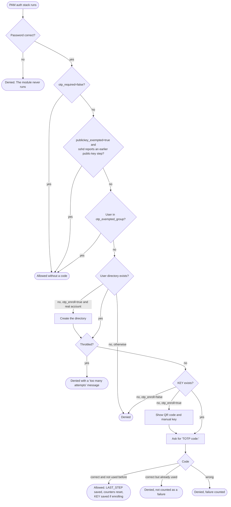

# pam-totp-rs

A Rust Linux-PAM authentication module that verifies a TOTP after an earlier PAM
module has checked the user's password. It supports self-enrollment at first
login, a group exemption, an SSH public-key exemption, per-user replay state
and failure throttling.

## How a login flows



## Self-enrollment

With `otp_enroll=true`, a user who has no key yet sets one up during their
first password login. Nothing has to be prepared per user.

What the administrator does once:

```sh
sudo install -d -o root -g root -m 0700 /etc/pam_totp
```

and adds `otp_enroll=true` to the module line (see the setup guide below).

What happens at the user's first login:

1. The user enters their password as usual.
2. The module creates `/etc/pam_totp/<user>` (mode `0700`), generates a random
   160-bit secret and prints a QR code plus the same secret as text.
3. The user scans the QR code with an authenticator app (or types the key in)
   and enters the six-digit code the app shows.
4. Only if that code is correct is the secret saved as `KEY` and the login
   allowed. A wrong code or a dropped connection saves nothing; the next login
   starts again with a new secret.

From then on the user is asked for `TOTP code:` after the password.

This is a capture of a real first login (test user in a throwaway container;
typed input is not echoed):

```text
$ ssh jack@host
(jack@host) Password:
First-time TOTP setup for jack. Scan this QR code with your authenticator, then enter the displayed six-digit code to finish enrollment.

█████████████████████████████████████████████████
█████████████████████████████████████████████████
████ ▄▄▄▄▄ █▀██████ ▄▄█▄▀▄▄▄▄▀▄▀▀█ ▄▀█ ▄▄▄▄▄ ████
████ █   █ █▀ ▄▄ █▄ ▄▀▀▄ ▄▄▄▄█ █▀▀█▀▄█ █   █ ████
████ █▄▄▄█ █▀▀▄▀▄▄ ▄▄▀▀▄█▄ ▄▀ ▀  ▄▄▄▄█ █▄▄▄█ ████
████▄▄▄▄▄▄▄█▄▀ ▀▄█▄█ █▄█ ▀ █▄█ ▀ █▄▀ █▄▄▄▄▄▄▄████
████  ▄▄▄▀▄ ▄▄▀▀ ▀ ▀ █▀█▀█▀▀▀  █▀ █▀▀▄▀ ▀▄█▄▀████
██████▀▄▀ ▄ ▄█  ▀ ▄ ▀▄▄▀█  ▀▀██▄▄█▀█▄▄█ █▀███████
████▄█  ▄ ▄▄█ ▀█▀▀▄ ▄▄▄▀▀▀▀▀██▄▄▄▄▀▀█▀▀▀▀█▄▄ ████
████ ▀▄▄█▄▄▀▄█▄█▀▄█ ▄█▀▀ ▀▀█▀▄▀  █▀██▀██  ▄▀█████
████▄▄█ █▀▄ ▀▀▀█▄█▄ ▀██▄  ▄▄▄▄▄█▀▄▀▀▀▀▀█▀▄▄▀▀████
████ ▀ ▄█▀▄   █▀ █▀ ▀█ ▀▄▀▄███▀ ▄▄████▄ █ █▀▀████
████ █ █▄ ▄ ▀█▀█▄█▀ ▀█ ▀▀██ ▄▄▀▄▀ ▀▀  ▀ ▀▄▄█▀████
█████▄▄▀▄█▄ ▄▄▄ ▄▄▀█▀█▄█▄ ▀▀██  █▄██▀█  ▄ ▄█▀████
████ ▄██▄▀▄███▀ ▀▀▄█▄ ▄ ▄  ▀▀▄▄█▀ █▀ █▀█▀ ▄▀ ████
█████ ▄█ ▄▄██▀▄█  ▄ ▀ ▀█▄▀▄█▄█▀▄█▄█▀ █▄██ █ ▀████
████ ▀██▀▄▄▄ █ █▀▀▄ ▄█▀ ▀▀ ▀▄▄██▀▄█  █▀▄▀ ▄ ▀████
████ █  ▄█▄▄▄███▀▄█ ▄▄▄▀█▀ █▀▄▀ ▀█▀▀ ▀██▀ █▀▀████
████▄█▄███▄█▀▄ ███▄  ▄▄█    █▄ ▄▀▄█▄ ▄▄▄ ▀▄█▀████
████ ▄▄▄▄▄ █▄█ ▀▄█▀▄▄█▄▀  ███▄▄▄█▄ ▄ █▄█ ▀█▄█████
████ █   █ █ ▀▄█▄█▀ ▀█▄▀ ▀▄▀▄▄▄█ ▄▀█▄▄▄ ▄▀▄█ ████
████ █▄▄▄█ █ ▄█ ▄█▄█▀▄▄█ ▀▀█▄▄█ ▄█ █▀█▄█  █▀█████
████▄▄▄▄▄▄▄█▄█▄▄█▄███████▄▄█▄▄▄█▄▄▄▄█▄███▄▄██████
█████████████████████████████████████████████████
█████████████████████████████████████████████████

If scanning does not work, add this key manually (SHA1, 6 digits, 30-second period):
C373IWSGY3RG3DQ33CT4DTLZCJD6P2M2
(jack@host) TOTP code:
LOGIN-OK
```

and the files it leaves behind:

```text
/etc/pam_totp:
-rw------- 1 root root  0 THROTTLE
drwx------ 2 root root  5 jack

/etc/pam_totp/jack:
-rw------- 1 root root 33 KEY
-rw------- 1 root root  9 LAST_STEP
-rw------- 1 root root  0 LOCK
```

Things to know before turning it on:

- Enrollment is trust-on-first-use. Whoever first presents the correct
  password for an account without a key enrolls their own device. That
  includes root and service accounts that have passwords. Enroll important
  accounts yourself, or exempt them, before exposing the host.
- The directory is created only for names that exist in the account database,
  and under the database's own spelling of the name, so `JACK` and `jack` on a
  case-insensitive directory service are one enrollment.
- The QR code and key stay in the terminal's scrollback and in any session
  recording. Clear the screen after enrolling.
- The QR code needs a UTF-8 terminal. It is drawn for dark-background
  terminals; set `qr_dark_terminal=false` if your users have light ones. The
  text key always works.
- To make a user enroll again, delete their `KEY` file.

## What each path looks like

All captured from real SSH logins (`ssh ... echo LOGIN-OK`).

Wrong password. The module never runs, so there is no TOTP prompt and no
enrollment:

```text
(jack@host) Password:
jack@host: Permission denied (publickey,keyboard-interactive).
```

Normal login for an enrolled user:

```text
(jack@host) Password:
(jack@host) TOTP code:
LOGIN-OK
```

Wrong code, or a code that was already used:

```text
(jack@host) Password:
(jack@host) TOTP code:
jack@host: Permission denied (publickey,keyboard-interactive).
```

After three wrong codes in a row, attempts are refused before the prompt:

```text
(jack@host) Password:
Too many failed TOTP attempts. Try again later.
jack@host: Permission denied (publickey,keyboard-interactive).
```

Member of `otp_exempted_group`, or public key followed by password with
`publickey_exempted=true`:

```text
(opsadmin@host) Password:
LOGIN-OK
```

What the administrator sees in the system log for the above:

```text
pam_totp: enrolled a new key for user jack from 127.0.0.1
pam_totp: already used code for user jack from 127.0.0.1
pam_totp: wrong code for user jack from 127.0.0.1
pam_totp: wrong code for user jack from 127.0.0.1
pam_totp: wrong code for user jack from 127.0.0.1
pam_totp: throttled user jack from 127.0.0.1
```

## Setup guide (SSH)

These steps use Debian/Ubuntu paths. Keep a second root session open the whole
time; a mistake in PAM or sshd configuration can lock you out.

### Options

| Option | Default | Meaning |
|---|---|---|
| `otp_required=true\|false` | `true` | `false` makes the module succeed without asking for a code. |
| `otp_exempted_group=NAME` | none | Members of this group skip the OTP step. |
| `publickey_exempted=true\|false` | `false` | Skip the OTP step when sshd reports an earlier public-key step. |
| `otp_enroll=true\|false` | `false` | Let a user without a `KEY` enroll at login. |
| `qr_dark_terminal=true\|false` | `true` | Draw the enrollment QR code for dark-background terminals. |
| `pam_working_dir=/abs/path` | `/etc/pam_totp` | Where keys and state are stored. |

An unknown option or a bad value makes the module fail every login, so check
spelling before closing your spare root session.

### 1. Install the module

Download `pam_totp-<arch>-linux-gnu.so` from the release page (or build it, see
Build below) and install it into the PAM module directory:

```sh
sudo install -o root -g root -m 0755 pam_totp-x86_64-linux-gnu.so \
  /usr/lib/x86_64-linux-gnu/security/pam_totp.so
```

The directory is the one that already contains `pam_unix.so`. On RHEL-family
systems it is `/usr/lib64/security`.

### 2. Create the working directory

```sh
sudo install -d -o root -g root -m 0700 /etc/pam_totp
```

The module never creates this directory. With `otp_enroll=true` that is all
the preparation needed. Without it, also create a directory for each user you
give a key to by hand:

```sh
sudo install -d -o root -g root -m 0700 /etc/pam_totp/jack
```

### 3. Give users a key

With `otp_enroll=true`, skip this step; see Self-enrollment above.

To create a key yourself:

```sh
sudo sh -c 'umask 077; head -c 20 /dev/urandom | base32 > /etc/pam_totp/jack/KEY'
sudo cat /etc/pam_totp/jack/KEY
```

Type the printed key into an authenticator app (time-based, SHA-1, 6 digits,
30 seconds), then check it before touching PAM:

```sh
sudo cat /etc/pam_totp/jack/KEY | otputil --key-stdin
```

The first line must match what the authenticator app shows.

### 4. Add the module to the sshd PAM stack

In `/etc/pam.d/sshd`, add the module directly after the password check:

```text
@include common-auth
auth required pam_totp.so otp_enroll=true
```

A wrong password must end authentication before this line is reached. The
stock Debian/Ubuntu `common-auth` does that. On other distributions, confirm
it by entering a wrong password and checking that no TOTP prompt appears; do
not enable `otp_enroll=true` until that holds, or someone without the password
could enroll their own key. Do not add the module as `sufficient`.

#### RHEL-family systems (RHEL, Rocky, Alma, Oracle Linux)

The stock `/etc/pam.d/sshd` there starts with `auth substack password-auth`.
A substack does not stop the outer stack when the password is wrong, so a
module placed after it would still run and could show an enrollment QR code to
someone without the password. Replace that one line with the local password
check run directly, as `requisite`:

```text
auth       required     pam_env.so
auth       required     pam_faildelay.so delay=2000000
auth       requisite    pam_unix.so
auth       required     pam_totp.so otp_enroll=true
auth       include      postlogin
```

This covers local accounts. If the host authenticates against a directory
(sssd), keep that module in the list as well.

The module goes in `/usr/lib64/security/`, and the service is `sshd`. With
SELinux enforcing, label the working directory so sshd may write its state:

```sh
sudo semanage fcontext -a -t var_auth_t '/etc/pam_totp(/.*)?'
sudo restorecon -R /etc/pam_totp /usr/lib64/security/pam_totp.so
```

This layout was checked with real logins on Rocky Linux 9 and on Oracle
Linux 10 with SELinux enforcing.

#### Exempting root

To let root skip the TOTP step, put this line directly before the module:

```text
auth [success=1 default=ignore] pam_succeed_if.so uid eq 0 quiet
```

Only do this where root cannot log in with a password
(`PermitRootLogin prohibit-password`), otherwise root is protected by the
password alone.

### 5. Configure sshd

In `/etc/ssh/sshd_config` (or a file in `/etc/ssh/sshd_config.d/`):

```text
UsePAM yes
KbdInteractiveAuthentication yes
PasswordAuthentication no
AuthenticationMethods publickey keyboard-interactive:pam
```

`PasswordAuthentication` must be off because that method cannot display a
second prompt; password logins go through keyboard-interactive instead.

The `AuthenticationMethods` line gives two alternatives: a public key alone,
or keyboard-interactive PAM (password, then OTP). A key-only login does not
run PAM's `auth` stack at all, so it never reaches this module. To require
more than a key, list the methods with a comma instead, for example
`publickey,keyboard-interactive:pam`; the module then asks for the OTP after
the password unless `publickey_exempted=true`, in which case the key replaces
the OTP. That exemption relies on OpenSSH's `SSH_AUTH_INFO_0`.

Validate and reload:

```sh
sudo sshd -t && sudo systemctl reload ssh
```

### 6. Test from a new connection

```sh
ssh -o PubkeyAuthentication=no jack@host
```

You should be asked for the password and then for `TOTP code:`. Also check
that a wrong code is refused and that reusing an accepted code is refused.

## Failure throttling

Wrong codes are counted in `/etc/pam_totp/THROTTLE`, a root-owned `0600` file
created by the module. It holds at most 4096 fixed-size records (about
213 KB); when full, the record with the oldest last failure is replaced. Each
record keeps the total failure count, the consecutive failure count and the
last three failure times.

Failures are counted per user and source address. The first two consecutive
wrong codes carry no penalty. From the third, further attempts for that user
from that address are refused for 5 seconds, doubling with each additional
wrong code (10 s, 20 s, 40 s, ...) up to one hour at the thirteenth.

The source address is `PAM_RHOST`. IPv6 addresses are grouped by their /64
prefix, since a client can change address freely inside it.

There is deliberately no counter per user across all addresses, so nobody can
keep a legitimate user out by failing on their behalf from somewhere else.
The cost is that an attacker who knows the password and controls many
addresses gets two free guesses from each; use a firewall or fail2ban if that
matters on your host.

Attempts made during a penalty are rejected without being checked and are not
counted. A reused code is refused but not counted either. A successful login
resets the consecutive count, as does a gap of more than 24 hours since the
last failure. Deleting `THROTTLE` clears all penalties.

## Logging

The module writes to syslog (`authpriv`, prefixed `pam_totp:`) when it rejects
a login or enrolls a key: invalid options, missing or unusable directory or
key, wrong code, reused code, throttled attempt, clock behind. Codes and keys
are never logged.

```sh
journalctl | grep pam_totp
```

## Troubleshooting and recovery

- Every login fails: check the log line above first, then option spelling,
  then ownership and modes. The working directory, user directory, `KEY`,
  `LAST_STEP`, `LOCK` and `THROTTLE` must all be owned by root and not
  accessible to group or others. Symlinks are refused.
- Correct codes are refused after the clock was corrected backwards: the
  module only accepts codes newer than the last one it accepted. Delete the
  user's `LAST_STEP` once the clock is right.
- Correct codes are refused after failed attempts: wait out the penalty or
  delete `/etc/pam_totp/THROTTLE`.
- To re-enroll a user, delete their `KEY`.
- To back out, remove the `pam_totp.so` line from `/etc/pam.d/sshd`.
- On SELinux systems, label the working directory `var_auth_t` (see the
  RHEL-family notes in step 4); without it sshd is denied access.

## Limits

- Six-digit SHA-1 TOTP, 30-second period, one step of clock skew either side.
  The host clock must be synchronized.
- Login names may contain letters, digits and `_ . - @`. Other names are
  rejected.
- A full disk stops codes being recorded as used, so logins fail closed.
  Keep an exempt administrator or a key-only path for that case.
- The module does not create accounts or configure sudo.
- It relies on `flock` and atomic rename in the working directory.

## Local test utility

```sh
cargo build --release --bin otputil
target/release/otputil --key BASE32_KEY
```

It prints codes for the current 30-second time step and the next two. Use
`--key-stdin` to avoid putting a key in process arguments, or `--key-file PATH`
to read one from a protected file. `--time UNIX_SECONDS` selects a fixed time
for repeatable tests. `otputil` is a test helper and is not installed with the
PAM module.

## Build

Build on the target Linux distribution (or with a matching Linux cross toolchain):

```sh
cargo build --release
sudo install -o root -g root -m 0755 target/release/libpam_totp.so \
  /usr/lib/x86_64-linux-gnu/security/pam_totp.so
```

Building needs the PAM development files (`libpam0g-dev` on Debian/Ubuntu,
`pam-devel` on RHEL-family systems).

## Releases

Pushing a tag that starts with `v` runs `.github/workflows/release.yml`, which
attaches `pam_totp-<arch>-linux-gnu.so`, `otputil-<arch>-linux-gnu` and
checksums for x86_64 (amd64) and aarch64 (arm64) to a GitHub Release:

```sh
git tag v0.1.0 && git push origin v0.1.0
```

There is one binary per architecture, not one per distribution. It is built on
AlmaLinux 8, so it needs only glibc 2.28 and runs on anything newer. Before
publishing, the workflow loads the module inside a container of each of these
and stops the release if any fails:

| Family | Versions checked |
|---|---|
| RHEL (UBI) | 8, 9, 10 |
| AlmaLinux | 8, 9, 10 |
| CentOS Stream | 9, 10 |
| Oracle Linux | 9 |
| Amazon Linux | 2023 |
| Fedora | latest |
| Ubuntu | 22.04, 24.04, 26.04 |
| Debian | 12, 13 |
| openSUSE | Leap 15.6, Tumbleweed |
| Arch Linux | latest (x86_64 only) |

That check covers loading against the distribution's libc and libpam. It does
not run a login; use `tests/e2e` for that. Alpine and other musl systems are
not supported by these binaries. Running the workflow by hand from the Actions
tab does the build and the checks without publishing.

Each binary carries a build provenance attestation:

```sh
gh attestation verify pam_totp-x86_64-linux-gnu.so --repo wushilin/pam_totp
```

## Tests

```sh
cargo test                                      # unit tests
cargo test --release -- --ignored --nocapture   # stress test, about a minute
```

The stress test runs several million operations across the TOTP, throttle, PAM
conversation and file paths and fails if peak memory or the number of open
file descriptors grows.

`tests/e2e` holds an end-to-end test that drives real SSH logins through every
path shown above. It reconfigures sshd and PAM, so run it only as root on a
disposable machine with the module already built:

```sh
sh tests/e2e/setup.sh && python3 tests/e2e/run.py
```
